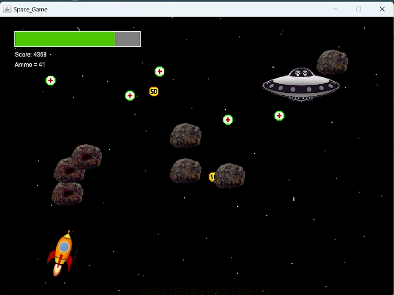

# Space-War-Game
Lets see how long you can survive in my space war game!

In the openning screen, press enter when you are ready to let the game begin.

## Game Elements

Spaceship - the player's character. Controled with the keyboard arrows keys. The goal of the spaceship is to fight against the aliens enemies that will show up throughout the game. It has a limited amount of health points, so it needs to be careful about getting hurt by rocks and enemies' shots. To defend itself, the spaceship can shoot either the rocks or the enemies and destroy them. You can shoot using space on the keyboard, and a yellow shot will be sent. Notice, the spaceship ammo is limited, so use it cleverly. You can look in the top left corner to see the health bar and the ammo left on the spaceship.

Rocks - the game generates rocks comming from above in random directions. In one hand, the rocks can hurt the spaceship and make demage, but on the other hand, if the spaceship destroies the rocks, some loot can get out of it (not always). And the rocks are even more interesting than that. The enemies' shots can hurt a rock too. In that case, the rock becomes evil and starts to move aiming at the spaceship!

Loot - the rocks that will be destroyed by the spaceship, with some probability, will remain a gift in the place of destruction. That gift can be either a health points, or an ammo supply of 50 shots. The get it, the spaceship needs the pass throw the gift position.

Enemies - will show up gradually throughout the game. The enemies look like spacecraft and can move only in the horizontal direction. They can shoot purple shots that can demage the spaceship and turn a rock into evil. To destroy an enemy spacecraft, you need 5 spaceship yellow shots to hurt it.

## Gameplay situations

- The spaceship is shooting at an enemy spacecraft:

- Enemy spacecraft shot going to hurt a rock, meanwhile, the spaceship can collect the loot accumulated

- Here we can see 3 rocks getting closer to the spaceship after they got affected by an enemy shot

## Game Ending

The game ends when the score (which can be seen in the top left corner) reaches 25,000.

If you will survive until there, you would see the ending screen:

Otherwise, you will get your score and see how long did you survive.

Want to try saving the universe? see the installation section below. 

## Installation
In order to play the game, follow the steps:
* Make sure Java Runtime Environment (JRE) or Java Development Kit (JDK) is installed on your PC and properly configured.
* Download the `SpaceWarGame.jar` file.
* Run the command: `java -jar SpaceWarGame.jar`.

Good Luck!
